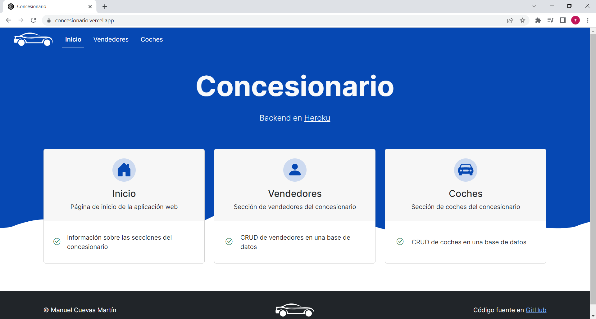
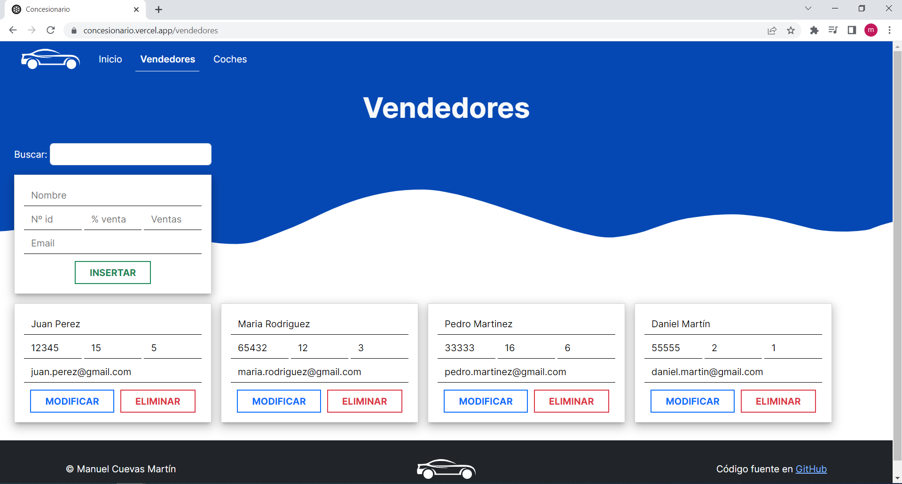

# Frontend del concesionario con Svelte

Este este repositorio, se describe el frontend de una aplicación web de un concesionario, desarrollada con Svelte y desplegada en Vercel.

> Importante:
>
> - Para ver todo el código, revisar el código fuente de este repositorio.
> - **La parte backend de esta aplicación puede verse en [concesionariobackend](https://github.com/mancuemar15/concesionariobackend).**
> - **La aplicación se encuentra desplegada en [concesionario](https://concesionario.vercel.app).**

## Inicio de un proyecto de Svelte

Para iniciar este proyecto de Svelte a partir de [esta plantilla](https://github.com/sveltejs/template), ejecutamos:

```console
npx degit sveltejs/template concesionario
```

A partir de esta plantilla, abrimos nuestro editor favorito y comenzaremos a crear y editar los archivos.

## Trabajar con Svelte

En primer lugar, necesitamos instalar las dependencias de nuestro proyecto. Estas dependencias se encuentran en el archivo `package.json` y se instalan ejecutando el siguiente comando:

```console
npm install
```

Una vez instaladas las dependencias, ya podemos ejecutar la aplicación. Para ello, ejecutamos:

```console
npm run dev
```

Nuestra aplicación quedará visible en http://localhost:8080

### Estructura de los componentes

Todos los componentes en Svelte se nombra con la primera letra en mayúscula y la extensión .svelte y disponen de 3 secciones:

```html
<script>
  // Código JavaScript
</script>

<!-- Elementos HTML y componentes web -->

<style>
  /* Código CSS */
</style>
```

En la sección de `script` escribiremos en JavaScript la funcionalidad del componente.

En la sección de `HTML y componentes web` escribiremos la estructura del componente. Para ello haremos uso de código HTML y ciertas extensiones de Svelte que iremos viendo más adelante.

Y en la sección de `style` escribiremos en CSS la presentación del componente. **En svelte los estilos CSS solamente se aplican al componente donde están definidos y a ningún otro componente, aunque tengan las mismas etiquetas**. Si queremos que una determinada etiqueta html tenga un estilo en todos los componentes usamos la forma `:global(etiqueta) { ... }` en lugar de `etiqueta {}` 

El orden es indiferente, aunque se recomienda organizar siguiendo el orden anterior.

## Estructura del proyecto

La estructura de archivos del proyecto es la siguiente:

```
├── .gitignore
├── package-lock.json
├── package.json
├── README.md
├── rollup.config.js
├── public
│   ├── global.css
│   ├── index.html
│   ├── robots.txt
│   └── img
│       ├── logo-concesionario.svg
│       ├── rueda.png
│       └── wave.svg
├── scripts
│   └── setupTypeScript.js
└── src
    ├── App.svelte
    ├── Boton.svelte
    ├── Buscar.svelte
    ├── Coche.svelte
    ├── Coches.svelte
    ├── Contenido.svelte
    ├── Footer.svelte
    ├── Inicio.svelte
    ├── Nav.svelte
    ├── Vendedor.svelte
    ├── Vendedores.svelte
    ├── helpers.js
    ├── main.js
    ├── store.js
    └── validators.js
```

El archivo `.gitignore` se utiliza para indicar a Git qué archivos o carpetas deben ser ignorados durante el seguimiento de versiones, evitando que se incluyan archivos innecesarios o confidenciales en el repositorio.

El archivo `package-lock.json` proporciona información detallada sobre las versiones exactas de las dependencias instaladas en un proyecto de Node.js para asegurar la consistencia y estabilidad del proyecto.

El archivo `package.json` es el archivo de gestión de proyecto y dependencias. En él podremos editar el nombre del autor, la versión, el tipo de licencia, etc.

El archivo `README.md` puede eliminarse o podemos editarlo a nuestro gusto. No es necesario para el funcionamiento de la aplicación, aunque pudiera ser interesante para fines de documentación.

El archivo `rollup.config.js` contiene la configuración del empaquetador, que en este caso es **Rollup**. No debemos borrar este archivo.

La carpeta `public` contiene el frontend en forma de contenido estático, el cual deberemos subir a nuestro servidor de producción una vez finalizado el proyecto.

La carpeta `scripts` se utiliza para almacenar scripts de automatización personalizados que se ejecutan durante el proceso de desarrollo, facilitando su gestión y mantenimiento.

La carpeta `src` contiene **nuestro código y todos los componentes web que hemos creando**. Cada vez que realicemos un cambio en los archivos de dicha carpeta, rollup volverá a compilar y pondrá el resultado en `public/build/bundle.css` y `public/build/bundle.js`. 

## Archivos del proyecto

A continuación, se explican los diferentes archivos de los que se compone el proyecto y la función que tienen, así como los módulos o componentes utilizados.

> NOTA: No se escribirá el código completo de los diferentes archivos, ya que se encuentra disponible en el repositorio y así se evita que quede desactualizado.

### Archivo **`public/index.html`**

Este archivo contiene el esqueleto de la página web y enlaza los archivos CSS y JavaScript necesarios para el funcionamiento de la aplicación. En este archivo, también se incluye el enlace a Bootstrap 5.

### Archivo **`public/global.css`**

En este archivo encontramos los estilos CSS globales que se aplican a todas las páginas de la aplicación. El objetivo principal del archivo es proporcionar una manera fácil y centralizada de definir estilos globales para la aplicación.

### Archivo **`public/robots.txt`**

Este archivo proporciona instrucciones a los motores de búsqueda web sobre qué páginas o secciones de un sitio web deben ser rastreadas o no.

### Archivos de imágenes en **`public/img`**

Estos archivos son las imágenes que se utilizan en  aplicación web. Son accesibles públicamente y se pueden cargar fácilmente desde el código HTML o CSS de la página web.

### Archivo **`scripts/setupTypeScript.js`**

Este archivo se utiliza para automatizar la configuración inicial de TypeScript en proyectos de JavaScript.

### Archivo **`src/App.svelte`**

Este es el componente principal de la aplicación. El contenido es el siguiente:

```html
<script>
	import { setContext } from "svelte";
	import { Router } from "svelte-routing";
	import Contenido from "./Contenido.svelte";
	import Footer from "./Footer.svelte";
	import Nav from "./Nav.svelte";

	const URL = {
		vendedores: "https://concesionariobackend.herokuapp.com/api/vendedores",
		coches: "https://concesionariobackend.herokuapp.com/api/coches",
	};

	setContext("URL", URL);
</script>

<Router>
	<Nav />
	<Contenido />
	<Footer />
</Router>

<div id="capa-opaca"/>
<div id="spinner-loading">
	<!-- Spinner - Consultar código fuente -->
</div>
<div id="toast-alerta">
  <!-- Toast de alerta - Consultar código fuente -->
</div>

<style>
  /* CSS - Consultar código fuente */
</style>
```

En la sección de `script`, importamos los paquetes, componentes y funciones que vayamos a usar. En este caso, importamos la función `setContext` de `svelte` y el componente `Router` que está en el paquete `svelte-routing`. Este paquete nos proporciona los componentes necesarios para crear enrutatodores (`Router`), enlaces (`Link`) y rutas (`Route`). Necesitaremos tener instalado dicho paquete, por lo que debemos ejecutar en el terminal:

```console
npm install svelte-routing
```

La función `setContext` es proporcionada por Svelte y nos permite establecer un contexto global para que todos los componentes de la aplicación puedan acceder a él. La uilizamos para establecer las URLs de las APIs que utilizaremos en otros componentes de la aplicación.

También, vamos a importar los componentes `Contenido`, `Footer` y `Nav`.

La estructura del componente `App` está formada por un `Router`, dentro del cual se definen tres componentes: `Nav`, que tiene los enlaces (`Link`) necesarios para la navegación, `Contenido`, que tiene las rutas (`Routes`) a los componentes necesarios y `Footer`, que tiene un enlace (`Link`).

Por otro lado, se han agregado varios elementos HTML adicionales a la página, incluyendo un spinner de carga (`#spinner-loading`), una capa opaca para cubrir la página durante la carga (`#capa-opaca`) y un contenedor de mensajes emergentes (`#toast-alerta`).

### Archivo **`Boton.svelte`**

Este componento nos permite insertar, modificar y eliminar datos de una colección (vendedores o coches). El código del componente es el siguiente:

```html
<script>
    import { getContext, onMount } from "svelte";
    import { jsonData } from "./store.js";
    import { ok, ko } from "./helpers.js";
    import { validarVendedor, validarCoche } from "./validators.js";

    export let tipo = "insertar";
    export let documento = {};
    export let coleccion = "vendedores";

    const URL = getContext("URL");
    let url = "";
    let clase = "";

    function insertar() {
        if (comprobarDocumentoValido()) {
            const opciones = {
                method: "POST",
                headers: {
                    "Content-Type": "application/json",
                },
                body: JSON.stringify(documento),
            };
            fetch(url, opciones)
                .then((response) => response.json())
                .then((data) => {
                    $jsonData = [...$jsonData, data];
                    ok("Se ha insertado correctamente.");
                })
                .catch(() => ko("No se ha podido insertar."));
        } else {
            ko("Datos incorrectos o vacíos. Por favor, revise los datos.");
        }
    }

    function modificar() {
        if (comprobarDocumentoValido()) {
            const opciones = {
                method: "PUT",
                headers: {
                    "Content-Type": "application/json",
                },
                body: JSON.stringify(documento),
            };
            fetch(`${url}/${documento._id}`, opciones)
                .then((response) => response.json())
                .then(() => ok("Se ha modificado correctamente."))
                .catch(() => ko("No se ha podido modificar."));
        } else {
            ko("Datos incorrectos o vacíos. Por favor, revise los datos.");
        }
    }

    function eliminar() {
        const opciones = {
            method: "DELETE",
        };
        fetch(`${url}/${documento._id}`, opciones)
            .then((response) => response.json())
            .then((data) => {
                $jsonData = $jsonData.filter(
                    (documento) => documento._id !== data._id
                );
                ok("Se ha eliminado correctamente.");
            })
            .catch(() => {
                ko("No se ha podido eliminar.");
            });
    }

    function comprobarDocumentoValido() {
        if (
            Object.keys(documento).length > 4 &&
            Object.values(documento).every((x) => x === 0 || Boolean(x)) &&
            handlerValidador(documento)
        ) {
            return true;
        }
        return false;
    }

    function handlerValidador(documento) {
        switch (coleccion) {
            case "vendedores":
                return validarVendedor(documento);
            case "coches":
                return validarCoche(documento);
        }
    }

    const handler = (() => {
        switch (tipo) {
            case "insertar":
                clase = "btn-outline-success";
                return insertar;
            case "modificar":
                clase = "btn-outline-primary";
                return modificar;
            case "eliminar":
                clase = "btn-outline-danger";
                return eliminar;
        }
    })();

    onMount(() => {
        switch (coleccion) {
            case "vendedores":
                url = URL.vendedores;
                break;
            case "coches":
                url = URL.coches;
                break;
        }
    });
</script>

<input type="button" class="{clase} btn fw-bold px-3 px-xl-4 my-0" value={tipo.toUpperCase()} on:click={handler}/>

<style>
  /* CSS - Consultar código fuente */
</style>
```

Este componente importa las funciones `getContext` y `onMount` de Svelte. La primera la utiliza para obtener la URL base de la API, mientras que la segunda la utiliza para obtener la URL específica de la colección y establecerla en la variable `url`.

El componente recibe las siguientes propiedades:

- `tipo`: define el tipo de operación que se va a realizar: insertar, modificar o eliminar.
- `documento`: el documento que se va a insertar, modificar o eliminar.
- `coleccion`: la colección en la que se van a realizar las operaciones.

Las propiedades que puede recibir un componente se indican con `export`.

Además, utiliza los siguientes módulos personalizados:

- `store.js`: para almacenar los datos de la colección en la aplicación.
- `helpers.js`: para mostrar mensajes de éxito o error después de cada operación.
- `validators.js`: para validar los datos del documento antes de enviarlos a la API.

Por otro lado, presenta las siguientes funciones:

- `insertar()`: envía una petición HTTP POST para insertar un nuevo documento en la colección. Si la operación es exitosa, agrega el nuevo documento a la lista de documentos almacenados en `store.js` y muestra un mensaje de éxito. Si no se pudo insertar, muestra un mensaje de error.
- `modificar()`: envía una petición HTTP PUT para modificar un documento existente y muestra un mensaje de éxito o error.
- `eliminar()`: envía una petición HTTP DELETE para eliminar un documento existente de la colección. Si la operación es exitosa, elimina el documento de la lista de documentos almacenados en `store.js` y muestra un mensaje de éxito. Si no se pudo eliminar, muestra un mensaje de error.
- `comprobarDocumentoValido()`: valida si el documento es válido antes de enviarlo a la API.
- `handlerValidador(documento)`: utiliza una función de validación específica para la colección (`validarVendedor()` o `validarCoche()`) para validar el documento.
- `handler()`: define el tipo de operación y establece la clase del botón en función del tipo.

La estructura del componente `Boton` esta compuesta por un `input` de tipo `button` que representa el botón. La clase y el valor del botón dependen del tipo de operación (`tipo`) y de la clase del botón (`clase`). Al hacer clic en el botón, se llama a la función correspondiente (`insertar()`, `modificar()` o `eliminar()`).

### Archivo **`Buscar.svelte`**

Este componente es una caja de búsqueda que permite al usuario buscar a través de una lista de elementos. La búsqueda se realiza en tiempo real a medida que el usuario escribe en el campo de búsqueda. El contenido es:

```html
<script>
    export let busqueda = "";
</script>

<!-- Clases a consultar en el código fuente -->
<label for="buscador">Buscar:</label>
<input type="search" id="buscador" bind:value={busqueda}/>

<style>
  /* CSS - Consultar código fuente */
</style>
```

El componente tiene la propiedad `busqueda` que es la cadena de texto que se utilizará como término de búsqueda.

La estructura del componente `Busqueda` esta compuesta por un `input` de tipo `search` que representa el campo de entrada del texto. Este `input` tiene como `value` la propiedad `busqueda`. A la propiedad `value` se le ha añadido la directiva `bind`, para que cualquier cambio en el valor del elemento de entrada actualice automáticamente el valor de la variable `busqueda` y viceversa. También, con esta directiva, conseguimos que la información pueda pasar del hijo al componente padre.

### Archivo **`Coche.svelte`**

El componente `Coche` muestra una formulario para introducir información sobre un coche, que se almacena en un objeto `coche`. El contenido es:

```html
<script>
    export let coche = {
        marca: "",
        modelo: "",
        numeroIdentificacion: 0,
        combustible: "",
        precio: 0,
    };
</script>

<!-- Clases a consultar en el código fuente -->
<input type="text" name="marca" placeholder="Marca" bind:value={coche.marca}/>
<input type="text" name="modelo" placeholder="Modelo" bind:value={coche.modelo}/>
<input type="number" name="numeroIdentificacion" placeholder="Nº id" min="0" step="1" bind:value={coche.numeroIdentificacion}/>
<input type="text" name="combustible" placeholder="Combustible" bind:value={coche.combustible}/>
<input type="number" name="precio" placeholder="Precio" min="0" max="9999999.99" step="0.01" bind:value={coche.precio}/><span>€</span>
<slot />

<style>
  /* CSS - Consultar código fuente */
</style>
```

El componente tiene la propiedad `coche` que se utilizará como documento.

La estructura del componente `Coche` esta compuesta por una serie de `input` de tipo `text` y `number`. Cada `input` tiene como `value` una propiedad diferente del objeto `coche`. A la propiedad `value` se le ha añadido la directiva `bind`.

Cada entrada de campo de texto tiene un atributo `name` y un atributo `placeholder` que indica el tipo de información que se espera introducir. Además, hay algunas restricciones en los campos numéricos, como un valor mínimo y máximo y un paso permitido.

### Archivo **`Coches.svelte`**

Este componente contiene la lógica para obtener los datos de coches de una API, filtrarlos y mostrarlos en la página. El contenido del componente es:

```html
<script>
    import { onMount, getContext } from "svelte";
    import Boton from "./Boton.svelte";
    import Buscar from "./Buscar.svelte";
    import Coche from "./Coche.svelte";
    import { jsonData } from "./store";
    import { mostrarSpinner, ocultarSpinner } from "./helpers";

    const URL = getContext("URL");

    let coche = {};
    let cochesFiltrados = [];
    let busqueda = "";

    const getCoches = async () => {
        mostrarSpinner();
        const response = await fetch(URL.coches);
        $jsonData = await response.json();
        ocultarSpinner();
    };

    onMount(getCoches);

    $: cochesFiltrados = $jsonData.filter((coche) =>
        RegExp(busqueda, "i").test(`${coche.marca} ${coche.modelo}`)
    );
</script>

<!-- Clases a consultar en el código fuente -->
<h1>Coches</h1>
<Buscar bind:busqueda />

<Coche {coche}>
    <Boton tipo="insertar" documento={coche} coleccion="coches" />
</Coche>

{#each cochesFiltrados as coche}
    <Coche {coche}>
        <Boton tipo="modificar" documento={coche} coleccion="coches"/>
        <Boton tipo="eliminar" documento={coche} coleccion="coches"/>
    </Coche>
{/each}
```

Este componente importa las funciones `getContext` y `onMount` de Svelte. La primera la utiliza para obtener la URL base de la API, mientras que la segunda la utiliza para ejectuar la función `getCoches`. También, importa los componentes `Boton`, `Buscar` y `Coche`, y el objeto `jsonData` del `store.js`. Este objeto se utiliza para almacenar los datos de los coches obtenidos desde la API. `jsonData` es un objeto reactivo de Svelte, lo que significa que si se actualiza su valor, los componentes que dependen de él se volverán a renderizar automáticamente.

Se define una función `getCoches` que se utiliza para obtener los datos de los coches de la API. La función utiliza `fetch` para realizar una solicitud HTTP GET al endpoint de coches. Una vez que se recibe la respuesta, se convierte a JSON y se almacena en la variable `jsonData`. También se llaman a las funciones `mostrarSpinner` y `ocultarSpinner`, que muestran y ocultan un spinner de carga respectivamente.

La última línea `$: cochesFiltrados` es una reactividad que filtra los coches según el valor de `busqueda` y actualiza `cochesFiltrados`.

La estructura del componente consta de un título `h1` con el nombre de la sección, del componente `Buscar` y de varios componentes `Coche` que integran componentes `Boton`.

Se utiliza la directiva de Svelte `#each` para iterar sobre el array `cochesFiltrados`, que es un array que se filtra a través de la variable `busqueda`. Esta recorre cada elemento y crea un componente `Coche`.

### Archivo **`Contenido.svelte`**

El componente `Contenido` es la sección principal (`main`), con las rutas y el componente asociado a cada una de ellas. Para las rutas hacemos uso del componente `Route` del paquete `svelte-routing`. El contenido del componente es el siguiente:

```html
<script>
    import { Route } from "svelte-routing";
    import Coches from "./Coches.svelte";
    import Inicio from "./Inicio.svelte";
    import Vendedores from "./Vendedores.svelte";
</script>

<main>
    <Route path="/" component={Inicio} />
    <Route path="/vendedores" component={Vendedores} />
    <Route path="/coches" component={Coches} />
</main>

<style>
  /* CSS - Consultar código fuente */
</style>
```

El componente importa otros componentes necesarios, en este caso `Route`, `Coches`, `Inicio`, y `Vendedores`.

La sección `main` contiene las rutas de la aplicación definidas usando el componente `Route`. Cada `Route` tiene un atributo `path` que define la ruta de acceso en la barra de direcciones del navegador y un atributo `component` que especifica el componente que se debe renderizar cuando se accede a esa ruta. En este caso, se tienen tres rutas:
- "/" (ruta principal) corresponde al componente `Inicio`.
- "/vendedores" corresponde al componente `Vendedores`.
- "/coches" corresponde al componente `Coches`.

### Archivo **`Footer.svelte`**

Este componente crea un pie de página. La sección central tiene un enlace a la página de inicio del sitio web utilizando el componente `Link` de `svelte-routing`. El componente `Link` tiene un atributo `to` que indica la ruta hacia la que redirigir. La imagen del logo se muestra dentro del componente `Link`. El pie de página también tiene un enlace a la página de GitHub del código fuente del sitio web utilizando la etiqueta `a`.

### Archivo **`Inicio.svelte`**

El componente `Inicio` muestra la página de inicio del concesionario. Consta de tres secciones para cada una de las categorías: Inicio, Vendedores y Coches.

La sección de cabecera incluye un título y un enlace a la página de Heroku donde se encuentra el backend de la aplicación web. La sección de cada categoría incluye un enlace mediante el componente `Link` de `svelte-routing` que lleva a la página correspondiente y una tarjeta que muestra información sobre la categoría y su correspondiente CRUD en la base de datos.

### Archivo **`Nav.svelte`**

Este componente define un menú horizontal que permite la navegación entre los diferentes componentes. El contenido es:

```html
<script>
    import { Link } from "svelte-routing";

    const opcionesNav = [
        { pagina: "Inicio", ruta: "/" },
        { pagina: "Vendedores", ruta: "/vendedores" },
        { pagina: "Coches", ruta: "/coches" },
    ];

    function getProps({ isCurrent }) {
        return { className: isCurrent ? "active" : null };
    }
</script>

<!-- Clases a consultar en el código fuente -->
<nav>
    <Link to="/">
        
    </Link>
    <button class="navbar-toggler m-0" type="button" data-bs-toggle="collapse" data-bs-target="#contenidoNavbar" aria-controls="contenidoNavbar" aria-expanded="false" aria-label="Menú de navegación">
        <span class="navbar-toggler-icon" />
    </button>
    <div class="collapse navbar-collapse" id="contenidoNavbar">
        <ul>
            {#each opcionesNav as opcion}
                <li>
                    <Link class="nav-link" to={opcion.ruta} {getProps}>{opcion.pagina}</Link>
                </li>
            {/each}
        </ul>
    </div>
</nav>

<style>
  /* CSS - Consultar código fuente */
</style>
```

El componente importa el componente `Link` del paquete `svelte-routing` y se utiliza para crear un enlace de navegación.

Este componente tiene una constante `opcionesNav` que es un array de objetos que contiene información sobre las diferentes opciones de navegación. Cada objeto tiene dos propiedades: `pagina` que es una cadena de texto que representa el nombre de la opción de navegación y `ruta` que es una cadena de texto que representa la ruta asociada a esa opción.

Se utiliza la función `getProps` que toma como argumento un objeto con una propiedad `isCurrent`. Devuelve un objeto con la propiedad `className` establecida en `"active"` si `isCurrent` es verdadero, de lo contrario, devuelve `null`.

La estructura del componente está definida dentro de una etiqueta `nav`. Dentro encontramos un componente `Link` con la propiedad `to` hacia `/` que dentro tiene el logo de la página. También, encontramos un elemento `button` que aparecerá cuando llegue a cierto ancho de píxeles para dispositivos más pequeños.

Por último, dentro de una lista desordenada `ul` con la directiva `#each` a partir de los elementos del array `opcionesNav` se generan las diferentes opciones del menú. Estas opciones se componen de un componente `Link` con la propiedad `to` para asociarlo con la ruta y la propiedad `getProps` que establece la clase active en el enlace de navegación si la ruta actual coincide con la ruta asociada a ese enlace.

### Archivo **`Vendedor.svelte`**

El componente `Vendedor` muestra una formulario para introducir información sobre un vendedor, que se almacena en un objeto `vendedor`. La estructura es muy similar a la del componente `Coche`, por lo que vamos a obviar su contenido, que está a disposición en el código fuente.

### Archivo **`Vendedores.svelte`**

Este componente contiene la lógica para obtener los datos de vendedores de una API, filtrarlos y mostrarlos en la página. Debido a que su contenido es muy parecido al del componente `Vendedores`, no vamos a explicarlo. Este se encuentra a disposición en el código fuente.

### Archivo **`helpers.js`**

Este archivo define cuatro funciones de utilidad que son utilizadas en la aplicación web. Su contenido es:

```javascript
const ok = (mensaje = "Operación realizada con éxito") => {
    const toastAlerta = document.querySelector("#toast-alerta");
    const toast = new bootstrap.Toast(toastAlerta);

    toastAlerta.classList.remove("text-bg-danger");
    toastAlerta.classList.add("text-bg-success");
    document.querySelector("#toast-alerta .toast-body").innerHTML = mensaje;

    toast.show();
};

const ko = (mensaje = "No se ha podido realizar la operación.") => {
    const toastAlerta = document.querySelector("#toast-alerta");
    const toast = new bootstrap.Toast(toastAlerta);

    toastAlerta.classList.remove("text-bg-success");
    toastAlerta.classList.add("text-bg-danger");
    document.querySelector("#toast-alerta .toast-body").innerHTML = mensaje;

    toast.show();
};

function mostrarSpinner() {
    document.querySelector("#spinner-loading").classList.remove("d-none");
    document.querySelector("#capa-opaca").classList.remove("d-none");
}

function ocultarSpinner() {
    document.querySelector("#capa-opaca").classList.add("d-none");
    document.querySelector("#spinner-loading").classList.add("d-none");
}

export { ok, ko, mostrarSpinner, ocultarSpinner };
```

La función `ok` muestra una alerta estilo Toast que indica que una operación se ha realizado con éxito. Recibe como parámetro `mensaje` (opcional) que es un mensaje que se mostrará en la alerta Toast. El valor predeterminado es `"Operación realizada con éxito"`.

La función `ko` muestra una alerta estilo Toast que indica que una operación no se ha podido realizar. Recibe como parámetro `mensaje` (opcional) que es un mensaje que se mostrará en la alerta Toast. El valor predeterminado es `"No se ha podido realizar la operación."`.

La función `mostrarSpinner` muestra una capa opaca y un spinner que indica que se están cargando los datos en la página. Mientras que la función `ocultarSpinner` oculta la capa opaca y el spinner.

### Archivo **`main.js`**

Este archivo es el punto de entrada a la aplicación. Se genera un objeto `app` que se instancia a partir del componente `App`. El contenido es el siguiente:

```javascript
import App from './App.svelte';

const app = new App({
	target: document.body
});

export default app;
```

### Archivo **`store.js`**

En este archivo se importa la función `writable` del paquete `svelte/store`, que permite crear un almacén de datos reactivo para ser utilizado en la aplicación.

Luego, se exporta una constante llamada `jsonData`, la cual es el almacén de datos que se inicia con un array vacío. Este almacén se puede usar en diferentes componentes de la aplicación para compartir datos y mantenerlos sincronizados en tiempo real.

El contenido del archivo es el siguiente:

```javascript
import { writable } from "svelte/store";

export const jsonData = writable([]);
```

### Archivo **`validators.js`**

Este archivo contiene dos funciones para validar la información de un vendedor y un coche, respectivamente. Su contenido es:

```javascript
const emailRegex = /^[a-zA-Z0-9.!#$%&'*+/=?^_`{|}~-]+@[a-zA-Z0-9](?:[a-zA-Z0-9-]{0,61}[a-zA-Z0-9])?(?:\.[a-zA-Z0-9](?:[a-zA-Z0-9-]{0,61}[a-zA-Z0-9])?)*$/;

function validarVendedor(vendedor) {
    if (vendedor.numeroIdentificacion < 0 || vendedor.numeroIdentificacion > 99999) {
        return false;
    } else if (vendedor.comision < 0 || vendedor.comision > 25) {
        return false;
    } else if (vendedor.vehiculosVendidos < 0) {
        return false;
    } else if (!emailRegex.test(vendedor.email)) {
        return false;
    }
    return true;
}

function validarCoche(coche) {
    if (coche.numeroIdentificacion < 0) {
        return false;
    } else if (coche.precio < 0 || coche.precio > 9999999.99) {
        return false;
    }
    return true;
}

export { validarVendedor, validarCoche }
```
Se define una constante `emailRegex` que es una expresión regular que se utiliza para validar el correo electrónico de un vendedor.

La función `validarVendedor(vendedor)` recibe un objeto con la información de un vendedor y verifica que todos los campos tengan valores válidos. Devuelve `true` si la información es válida y `false` en caso contrario. Se deben cumplir las siguientes condiciones:
- `numeroIdentificacion`: número entero positivo de máximo 5 dígitos.
- `comision`: número decimal entre 0 y 25.
- `vehiculosVendidos`: número entero positivo.
- `email`: debe validar la expresión regular `emailRegex`.

La función `validarCoche(coche)` recibe un objeto con la información de un coche y verifica que todos los campos tengan valores válidos. Devuelve `true` si la información es válida y `false` en caso contrario. Se deben cumplir las siguientes condiciones:
- `numeroIdentificacion`: número entero positivo.
- `precio`: número decimal positivo.

## Construir la aplicación para el entorno de producción

Para crear una versión optimizada de la aplicación, ejecutamos:

```bash
npm run build
```

Puedes ejecutar la aplicación recién creada con `npm run start`. Esto utiliza [sirv](https://github.com/lukeed/sirv), que se incluye en las `dependencias` de `package.json` para que la aplicación funcione cuando se implemente en plataformas como [Heroku](https://heroku.com).

## Single-Page App

**Esta es una aplicación de página única (SPA)**.

Por defecto, sirv solo responderá a las solicitudes que coincidan con los archivos en `public`. Esto es para maximizar la compatibilidad con los servidores de archivos estáticos, lo que le permite implementar su aplicación en cualquier lugar.

Si estás creando una aplicación de una sola página (SPA) con varias rutas, sirv debe poder responder a las solicitudes de *cualquier* ruta. Puedes hacerlo editando el comando `"start"` en package.json:

```javascript
"start": "sirv public --single"
```

> NOTA: sirv es el módulo de node que permite ejecutar un servidor web y mostrar nuestra aplicación.

## Funcionamiento de la aplicación

La aplicación web permite a los usuarios consultar los coches disponibles en el concesionario y ver la información de los vendedores. Todas las páginas tienen el menú horizontal con el logo y los enlaces a las diferentes secciones, y el footer con el nombre del autor, el logo del concesionario y el enlace al repositorio donde se encuentra el código fuente.

### Página de inicio

La página de inicio muestra las tres secciones disponibles de la aplicación junto con las diferentes acciones que pueden realizar en las secciones. También, tiene un enlace al backend de la aplicación, desplegado en Heroku.



### Página de vendedores

La página de vendedores muestra la información de los diferentes vendedores, pudiendo insertar, modificar o eliminar alguno de ellos. Si la operación ha sido existosa, se muestra un mensaje en color verde de éxito. Si no se ha podido realizar la operación, se muestra un mensaje de error en color rojo. Los vendedores tienen los siguientes datos: nombre, nº id, % ventas, ventas y email.

También, existe un buscador en el que podemos buscar a algún vendedor por su nombre.



### Página de coches

La página de coches muestra la información de los diferentes coches, pudiendo insertar, modificar o eliminar alguno de ellos. Si la operación ha sido existosa, se muestra un mensaje en color verde de éxito. Si no se ha podido realizar la operación, se muestra un mensaje de error en color rojo. Los coches tienen los siguientes datos: marca, modelo, nº id, combustible y precio.

También, existe un buscador en el que podemos buscar algún coche por su marca o modelo.


## Tecnologías utilizadas

La aplicación ha sido desarrollada con las siguientes tecnologías:
- **Svelte**: Frontend framework para construir interfaces de usuario.
- **HTML**: Lenguaje de marcado para crear la estructura de la página web.
- **CSS**: Lenguaje de estilos para dar estilo a la página web.
- **Bootstrap 5**: Framework CSS que proporciona herramientas y componentes predefinidos para crear interfaces de usuario responsivas y atractivas.
- **JavaScript**: Lenguaje de programación para añadir interactividad a la página web.
- **Vercel**: Servicio de alojamiento web para desplegar la aplicación.
- **Node.js**: Entorno de ejecución de JavaScript que nos permite ejecutarlo fuera del navegador.
- **npm**: Gestor de paquetes para administrar las dependencias de las librerías y paquetes externos.

## Despliegue en Vercel

Este frontend no contiene código de servidor, es decir, no contiene código para backend. Por lo tanto, podemos desplegarlo como hariamos con cualquier página HTML. Para este despligue, vamos a utilizar **[vercel](https://vercel.com)**. 

Realizaremos el despliegue mediante interfaz de texto. A continuación se muestran los pasos a serguir con Vercel: 

> NOTA: Previamente deberás estar registrado. 

1. Instala `vercel` si aún no lo has hecho.

```console
npm install -g vercel
```

2. Luego, desde la carpeta de tu proyecto, inicia sesión.

```console
vercel login
```

3. Por último, para desplegar la aplicación en producción ejecuta:

```console
vercel --prod
```

> NOTA: Sigue las instrucciones del comando, proporcionando la información requerida.
